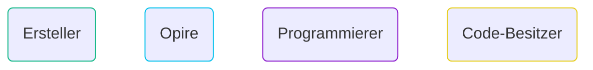
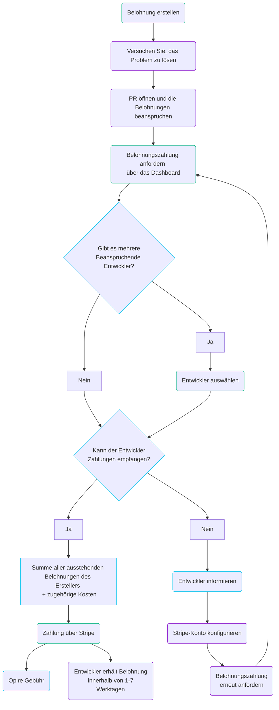

# Lebenszyklus

Bei Opire beginnt der Lebenszyklus einer Belohnung, wenn ein Benutzer die Lösung eines Problems anregen möchte. Dieser Prozess beginnt mit der Erstellung einer Belohnung, die mit einem *Issue* verknüpft ist, unter Verwendung von [unseren Befehlen](/de/overview/commands#belohnung-erstellen) oder der Webplattform.

Nachdem die Belohnung erstellt wurde, erscheint sie auf der [Opire-Plattform](https://app.opire.dev) sowie auf dem Problem selbst. Jeder Programmierer kann die Belohnung anzeigen und entscheiden, ob er versuchen möchte, das Problem zu lösen, und andere mit dem [Versuch](/overview/commands#try-to-solve-the-issue) -Befehl benachrichtigen.

Sobald der Programmierer einen Pull-Request (PR) mit den erforderlichen Änderungen öffnet, kann er die mit dem Problem verbundenen Belohnungen [beanspruchen](/overview/commands#claim-rewards-associated-with-an-issue). Dies benachrichtigt die Belohnungsersteller mit einem Link zum PR und gibt an, dass sie mit der Zahlung fortfahren können.

Der Ersteller kann nach Überprüfung des PR die Belohnungszahlung über das Opire-Dashboard initiieren. Wenn mehrere Programmierer die gleichen Belohnungen beansprucht haben, **muss der Ersteller wählen, wem er bezahlen möchte**.

An diesem Punkt führt die Plattform eine Überprüfung durch, um festzustellen, ob der Belohnungsempfänger die Möglichkeit hat, Zahlungen zu erhalten. Wenn der Benutzer Zahlungen erhalten kann, leitet Opire den Ersteller zu einem Stripe-Zahlungsportal weiter. Der endgültige Zahlungsbetrag wird der Belohnungsbetrag plus den [zugehörigen Kosten](/rewards/pricing#minimum-price-and-costs) sein. Nach Abschluss der Zahlung erhält der Benutzer die Belohnung innerhalb von etwa 1-7 Werktagen.

Alternativ, wenn der Benutzer keine Zahlungen erhalten kann, informiert die Plattform den Benutzer über diese Situation und fordert ihn auf, sein Stripe-Konto zu konfigurieren. Sobald konfiguriert, muss der Benutzer den Ersteller benachrichtigen, um die Belohnungszahlung erneut zu versuchen.

## Mehrere Belohnungen

Ein weiteres Merkmal von Opire ist, dass es keine Grenzen für die Anzahl der Belohnungen gibt, die für ein einzelnes Problem erstellt werden können.

Wenn jemand lieber mit einem bescheideneren Betrag beginnt, kann er jederzeit weitere Belohnungen hinzufügen. Diese werden zu den vorhandenen hinzugefügt, und der Ersteller zahlt alle ausstehenden Belohnungen, wenn jemand sie beansprucht.

## Mehrere Ersteller

Darüber hinaus können mehrere Benutzer daran interessiert sein, Belohnungen für dasselbe Problem zu erstellen.

In diesem Fall unterstützt Opire auch diese kooperative Anstrengung, sodass der Betrag, den der Programmierer erhält, die Summe aller Belohnungen ist, die von verschiedenen Benutzern erstellt wurden. **Jeder Ersteller zahlt seinen Teil separat**.

## Flussdiagramm

