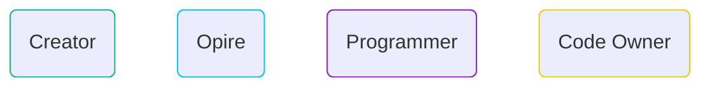
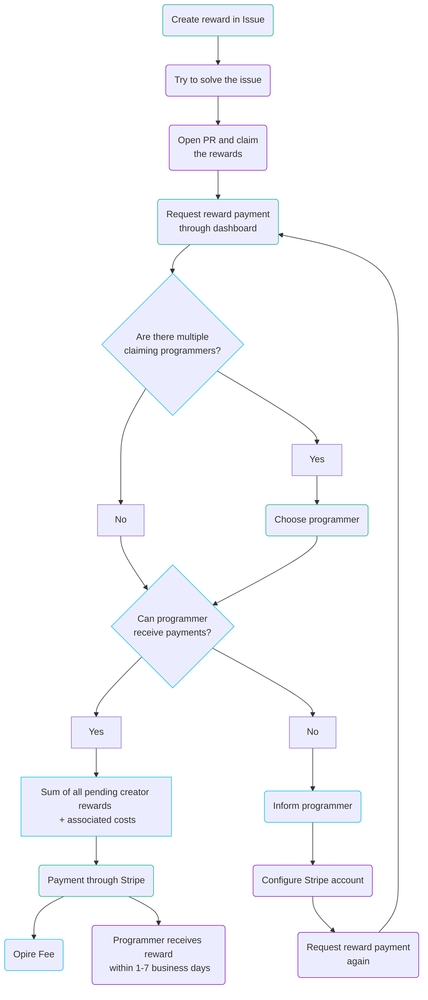

# Lifecycle

At Opire, the lifecycle of a reward begins when a user wants to incentivize the resolution of an issue. This process starts by creating a reward associated with an issue using [our commands](/overview/commands#create-reward) or the web platform.

Upon creating the reward, it will appear on the [Opire platform](https://app.opire.dev), as well as on the issue itself. Any programmer can view the reward and decide whether to attempt to resolve the issue, notifying others using the [try](/overview/commands#try-to-solve-the-issue) command.

Once the programmer opens a pull request (PR) with the necessary changes, they can [claim](/overview/commands#claim-rewards-associated-with-an-issue) the rewards associated with the issue. This notifies the reward creators with a link to the PR, indicating that they can proceed with the payment.

The creator, after reviewing the PR, can initiate the reward payment through the Opire dashboard. If multiple programmers have claimed the same rewards, the creator **must choose whom to pay**.

At this point, the platform performs a verification to determine if the reward recipient has the capability to receive payments. If the user can receive payments, Opire redirects the creator to a Stripe payment gateway. The final payment amount will be the reward amount plus the [associated costs](/rewards/pricing#minimum-price-and-costs). Upon completing the payment, the user receives the reward within approximately 1-7 business days.

Alternatively, if the user cannot receive payments, the platform informs the user of this situation and prompts them to configure their Stripe account. Once configured, the user must notify the creator to attempt the reward payment again.

## Multiple Rewards

Another distinctive feature of Opire is that there are no limits on the number of rewards that can be created for a single issue.

If someone prefers to start with a more modest amount, they can always add more rewards in the future. These will be added to existing ones, and the creator will pay for all pending rewards when someone claims them.

## Multiple Creators

Furthermore, multiple users may be interested in creating rewards for the same issue.

In this case, Opire also supports this collaborative effort, so the amount the programmer receives will be the sum of all rewards created by different users. **Each creator will pay their part separately**.

## Flowchart

