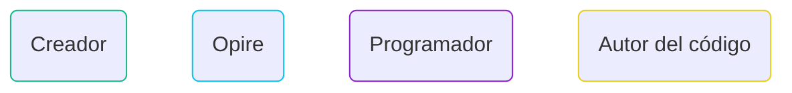
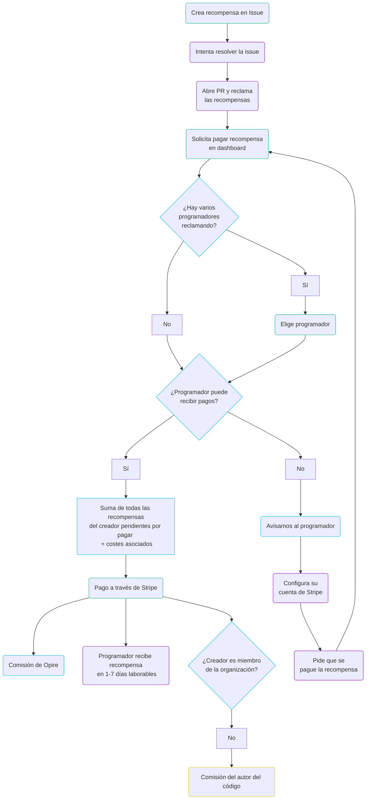

# Ciclo de vida

En Opire, el ciclo de vida de una recompensa se inicia cuando un usuario quiere incentivar que se resuelva un problema. Este proceso comienza al crear una recompensa asociada a una *Issue* utilizando [nuestros comandos](/es/overview/commands#crear-recompensa).

Al crear la recompensa, esta aparecerá en la plataforma de [Opire](https://app.opire.dev), además de en la propia issue (con un mensaje de nuestro bot y una etiqueta con la cantidad de la recompensa). Cualquier programador puede ver la recompensa y decidir si quiere intentar resolver la issue. Para ello, puede hacerselo saber al resto utilizando el comando [try](/es/overview/commands#intentar-resolver-la-issue).

Una vez el programador abra una PR con los cambios que considere necesarios, puede [reclamar](/es/overview/commands#reclamar-las-recompensas-asociadas-a-una-issue) las recompensas asociadas a la issue. Esto notificará a los creadores de las recompensa con un enlace a tu PR, para avisarles de que ya pueden proceder con el pago. 

El creador, después de revisar la PR, puede iniciar el pago de la recompensa a través del dashboard de Opire. Si hay varios programadores que hayan reclamado las mismas recompensas, el creador de las mismas **deberá elegir a quién pagarle**.

En este punto, la plataforma realiza una verificación para determinar si el usuario destinatario de la recompensa tiene la capacidad de recibir pagos. Si el usuario puede recibir pagos, Opire redirige al creador a una pasarela de pago de Stripe. El precio final a pagar será el de la recompensa más los [costes asociados](/es/rewards/pricing#precio-mínimo-y-costes). Tras finalizar el pago, el usuario recibe la recompensa aproximadamente en un plazo de 1-7 días laborables. En cambio, si el usuario no tiene la capacidad de recibir pagos, la plataforma informa al usuario sobre esta situación para que configure su cuenta de Stripe. Una vez configurada, el usuario tendrá que avisar al creador para que intente tramitar de nuevo el pago de la recompensa.

## Creador no relacionado con la organización

Opire da flexibilidad total a la hora de crear las recompensas, no importa si eres uno de los mantenedores del proyecto o un usuario interesado en el mismo. 

Si quien crea la recompensa es alguien ajeno al proyecto (no está entre los miembros de la organización que aloja el código del proyecto), a la hora de pagar la recompensa se cobrará un [porcentaje extra](/es/rewards/pricing#porcentaje-para-el-autor-del-código) que irá destinado a los autores del código.

Por contra, si quien crea la recompensa es miembro del proyecto, dicho porcentaje no será aplicado a los costes finales.

## Múltiples recompensas

Otro factor diferencial de Opire es que no hay límites en el número de recompensas que se pueden crear para una misma issue.

Si alguien prefiere empezar por una cantidad más modesta, siempre puede añadir más recompensas en el futuro. Estas serán añadidas a las ya existentes, de forma que el creador pagará todas las que tenga pendientes cuando alguien las reclame. 

## Múltiples creadores

Además de todo esto, puede que varios usuarios estén interesados en crear recompensas para una misma issue.

En este caso, Opire también respalda este esfuerzo colaborativo, de forma que la recompensa que recibirá el programador será la suma de todas las recompensas creadas por los diferentes usuarios. **Cada creador pagará su parte por separado**.

## Gráfica de flujo

