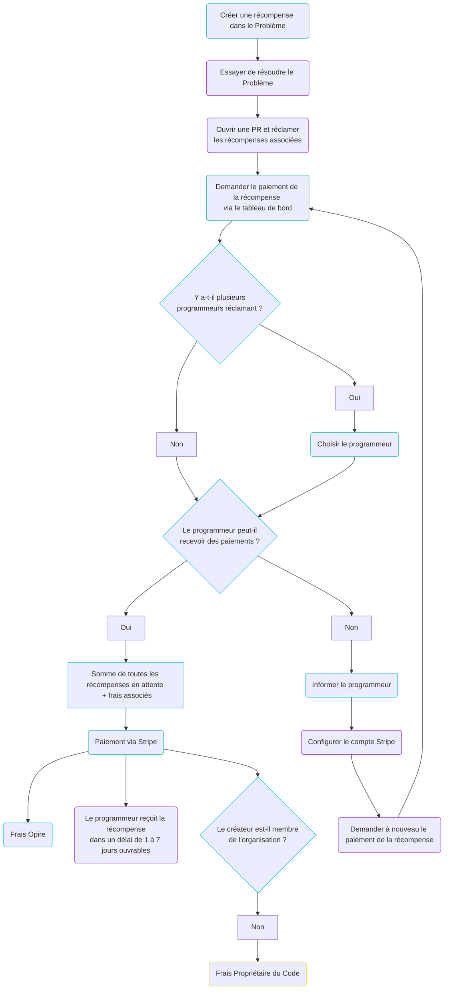

# Cycle de vie

Chez Opire, le cycle de vie d'une récompense commence lorsque qu'un utilisateur souhaite inciter à la résolution d'un problème. Ce processus commence par la création d'une récompense associée à un problème en utilisant [nos commandes](/overview/commands#create-reward).

Une fois la récompense créée, elle apparaîtra sur la [plateforme Opire](https://app.opire.dev), ainsi que sur le problème lui-même (avec un message de notre bot et une étiquette indiquant le montant de la récompense). Tout programmeur peut consulter la récompense et décider s'il souhaite tenter de résoudre le problème, en informant les autres en utilisant la [commande d'essai](/overview/commands#try-to-solve-the-issue).

Une fois que le programmeur a ouvert une demande de tirage (PR) avec les changements nécessaires, il peut [réclamer](/overview/commands#claim-rewards-associated-with-an-issue) les récompenses associées au problème. Cela informe les créateurs de récompenses avec un lien vers le PR, indiquant qu'ils peuvent procéder au paiement.

Le créateur, après avoir examiné le PR, peut initier le paiement de la récompense via le tableau de bord Opire. Si plusieurs programmeurs ont réclamé les mêmes récompenses, le créateur **doit choisir qui payer**.

À ce stade, la plateforme effectue une vérification pour déterminer si le destinataire de la récompense est capable de recevoir des paiements. Si l'utilisateur peut recevoir des paiements, Opire redirige le créateur vers une passerelle de paiement Stripe. Le montant final du paiement sera le montant de la récompense plus les [coûts associés](/rewards/pricing#minimum-price-and-costs). Après avoir effectué le paiement, l'utilisateur reçoit la récompense dans un délai d'environ 1 à 7 jours ouvrables.

Alternativement, si l'utilisateur ne peut pas recevoir de paiements, la plateforme l'informe de cette situation et l'invite à configurer son compte Stripe. Une fois configuré, l'utilisateur doit informer le créateur pour tenter à nouveau le paiement de la récompense.

## Créateur non lié à l'organisation

Opire offre une flexibilité totale lors de la création de récompenses, que vous soyez l'un des mainteneurs du projet ou un utilisateur intéressé.

Si le créateur de la récompense est externe au projet (non parmi les membres de l'organisation hébergeant le code du projet), un [pourcentage supplémentaire](/rewards/pricing#percentage-for-code-owner) sera facturé lors du paiement de la récompense, et il ira aux propriétaires du code.

En revanche, si le créateur de la récompense est un membre du projet, ce pourcentage ne sera pas appliqué aux coûts finaux.

## Récompenses multiples

Une autre caractéristique distinctive d'Opire est qu'il n'y a pas de limites au nombre de récompenses pouvant être créées pour un seul problème.

Si quelqu'un préfère commencer par un montant plus modeste, il peut toujours ajouter plus de récompenses à l'avenir. Celles-ci seront ajoutées aux existantes, et le créateur paiera toutes les récompenses en attente lorsque quelqu'un les réclamera.

## Multiples créateurs

De plus, plusieurs utilisateurs peuvent être intéressés par la création de récompenses pour le même problème.

Dans ce cas, Opire soutient également cet effort collaboratif, donc le montant que le programmeur reçoit sera la somme de toutes les récompenses créées par différents utilisateurs. **Chaque créateur paiera sa part séparément**.

## Diagramme de flux

