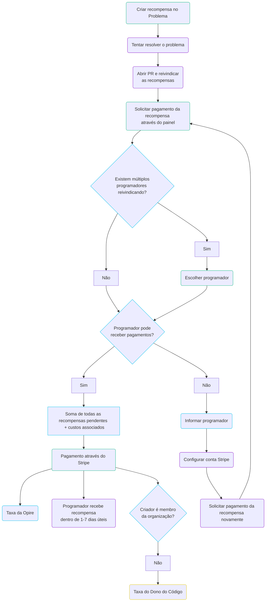

# Ciclo de Vida

Na Opire, o ciclo de vida de uma recompensa começa quando um usuário deseja incentivar a resolução de um problema. Esse processo começa criando uma recompensa associada a um problema usando [nossos comandos](/overview/commands#create-reward).

Ao criar a recompensa, ela aparecerá na [plataforma Opire](https://app.opire.dev), bem como no próprio problema (com uma mensagem do nosso bot e um rótulo indicando o valor da recompensa). Qualquer programador pode visualizar a recompensa e decidir se tentará resolver o problema, notificando outros usando o [comando try](/overview/commands#try-to-solve-the-issue).

Quando o programador abre uma solicitação de pull request (PR) com as alterações necessárias, ele pode [reivindicar](/overview/commands#claim-rewards-associated-with-an-issue) as recompensas associadas ao problema. Isso notifica os criadores de recompensa com um link para o PR, indicando que eles podem prosseguir com o pagamento.

O criador, após revisar o PR, pode iniciar o pagamento da recompensa através do painel Opire. Se vários programadores reivindicaram as mesmas recompensas, o criador **deve escolher a quem pagar**.

Neste ponto, a plataforma realiza uma verificação para determinar se o destinatário da recompensa tem a capacidade de receber pagamentos. Se o usuário puder receber pagamentos, a Opire redirecionará o criador para um gateway de pagamento Stripe. O valor final do pagamento será o valor da recompensa mais os [custos associados](/rewards/pricing#minimum-price-and-costs). Ao concluir o pagamento, o usuário receberá a recompensa em aproximadamente 1-7 dias úteis.

Alternativamente, se o usuário não puder receber pagamentos, a plataforma informará o usuário dessa situação e solicitará que ele configure sua conta Stripe. Uma vez configurado, o usuário deve notificar o criador para tentar o pagamento da recompensa novamente.

## Criador Não Relacionado à Organização

A Opire fornece completa flexibilidade ao criar recompensas, seja você um dos mantenedores do projeto ou um usuário interessado.

Se o criador da recompensa for externo ao projeto (não estiver entre os membros da organização que hospeda o código do projeto), uma [porcentagem adicional](/rewards/pricing#percentage-for-code-owner) será cobrada ao pagar a recompensa, e irá para os proprietários do código.

Por outro lado, se o criador da recompensa for um membro do projeto, essa porcentagem não será aplicada aos custos finais.

## Múltiplas Recompensas

Outra característica distintiva da Opire é que não há limites para o número de recompensas que podem ser criadas para um único problema.

Neste caso, a Opire também apoia esse esforço colaborativo, então o valor que o programador recebe será a soma de todas as recompensas criadas por diferentes usuários. **Cada criador pagará sua parte separadamente**.

## Múltiplos Criadores

Além disso, vários usuários podem estar interessados em criar recompensas para o mesmo problema.

Neste caso, a Opire também suporta esse esforço colaborativo, então o valor que o programador recebe será a soma de todas as recompensas criadas por diferentes usuários. **Cada criador pagará sua parte separadamente**.

## Fluxograma

