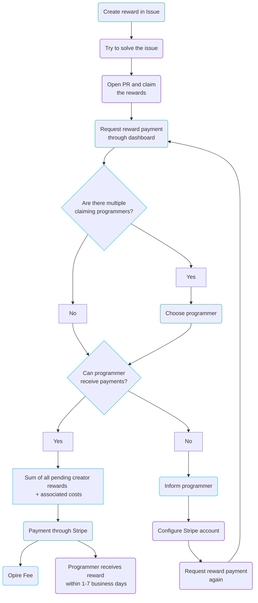

# 生命周期

在 Opire 中，奖励的生命周期始于用户希望激励解决问题。这个过程通过使用 [我们的命令](/overview/commands#create-reward) 或者网站平台创建与问题相关联的奖励开始。

创建奖励后，它将出现在 [Opire 平台](https://app.opire.dev) 上，以及问题本身上。任何程序员都可以查看奖励并决定是否尝试解决问题，使用 [try](/overview/commands#try-to-solve-the-issue) 命令通知其他人。

一旦程序员提交了带有必要更改的拉取请求（PR），他们就可以 [claim](/overview/commands#claim-rewards-associated-with-an-issue) 与问题相关联的奖励。这会向奖励创建者发送一个包含 PR 链接的通知，指示他们可以进行支付。

创建者在审查了 PR 后，可以通过 Opire 仪表板启动奖励支付。如果多个程序员声明了相同的奖励，创建者 **必须选择要支付的人**。

此时，平台会进行验证，以确定奖励接收者是否有能力接收支付。如果用户可以接收支付，Opire 将重定向创建者到 Stripe 支付网关。最终支付金额将是奖励金额加上 [相关成本](/rewards/pricing#minimum-price-and-costs)。完成支付后，用户将在约 1-7 个工作日内收到奖励。

另外，如果用户无法接收支付，平台会通知用户，并提示他们配置他们的 Stripe 帐户。配置完成后，用户必须通知创建者再次尝试奖励支付。

## 多个奖励

Opire 的另一个独特特点是，可以为单个问题创建的奖励数量没有限制。

在这种情况下，Opire 还支持这种合作努力，因此程序员收到的金额将是由不同用户创建的所有奖励的总和。**每个创建者将分别支付他们的一部分**。

## 流程图

