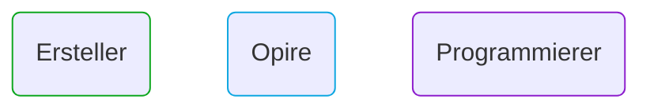
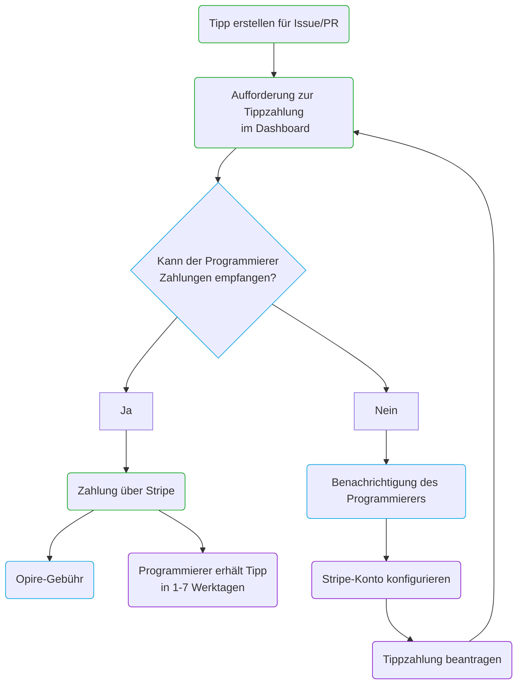

# Lebenszyklus

Bei Opire beginnt der Lebenszyklus eines Trinkgelds, wenn ein Benutzer beschließt, die Bemühungen eines anderen Benutzers anzuerkennen. Dieser Prozess beginnt damit, ein Trinkgeld zu erstellen, das mit einem Issue oder einem Pull Request (PR) verbunden ist, indem [unsere Befehle](/overview/commands#tip-a-user) verwendet werden.

Nachdem das Trinkgeld erstellt wurde, kann der Ersteller die Zahlung über das Opire-Dashboard initiieren. Zu diesem Zeitpunkt führt die Plattform eine Überprüfung durch, um festzustellen, ob der Benutzer, der das Trinkgeld erhält, in der Lage ist, Zahlungen anzunehmen.

Wenn der Benutzer Zahlungen empfangen kann, leitet Opire den Ersteller an ein Stripe-Zahlungsgateway weiter. Der endgültige zu zahlende Betrag besteht aus dem Trinkgeldbetrag zuzüglich der [zugehörigen Kosten](/tips/pricing#minimum-price-and-costs). Nach Abschluss der Zahlung erhält der Benutzer das Trinkgeld innerhalb von etwa 1-7 Werktagen.

Kann der Benutzer jedoch keine Zahlungen empfangen, informiert die Plattform den Benutzer über diese Situation, damit er sein Stripe-Konto konfigurieren kann. Nachdem das Konto konfiguriert wurde, muss der Benutzer den Ersteller benachrichtigen, um den Trinkgeldzahlungsversuch erneut zu starten.

## Flussdiagramm

