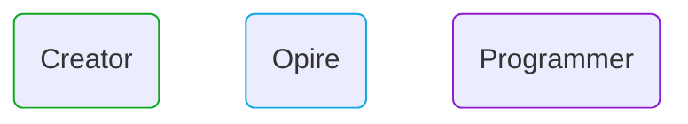
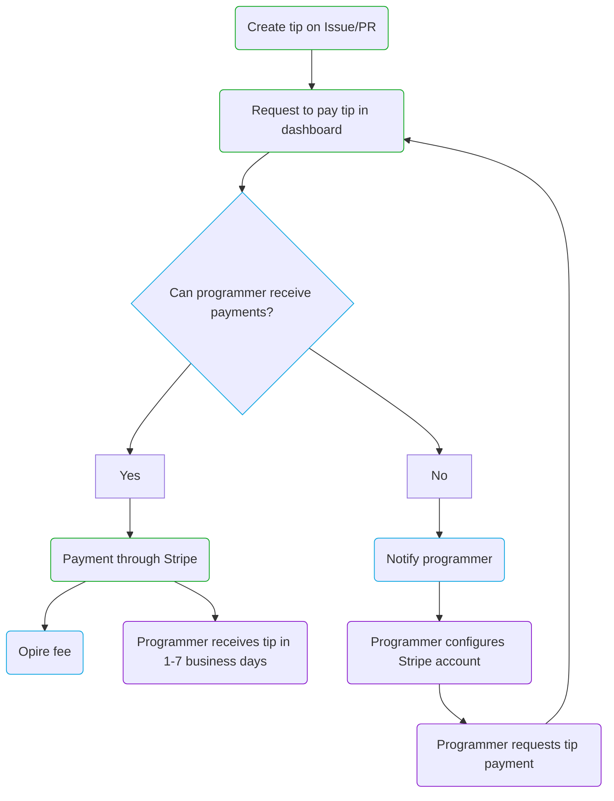

# Lifecycle

In Opire, the lifecycle of a tip begins when a user decides to acknowledge the efforts of another user. This process starts by creating a tip associated with an Issue or Pull Request (PR) using [our commands](/overview/commands#tip-a-user).

After creating the tip, the creator can initiate the payment through the Opire dashboard. At this point, the platform performs a verification to determine if the user receiving the tip has the capability to accept payments.

If the user can receive payments, Opire redirects the creator to a Stripe payment gateway. The final amount to be paid will be the tip amount plus the [associated costs](/tips/pricing#minimum-price-and-costs). After completing the payment, the user receives the tip within approximately 1-7 business days.

However, if the user cannot receive payments, the platform informs the user about this situation to configure their Stripe account. Once configured, the user needs to notify the creator to attempt the tip payment again.

---

