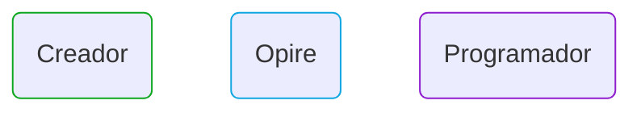
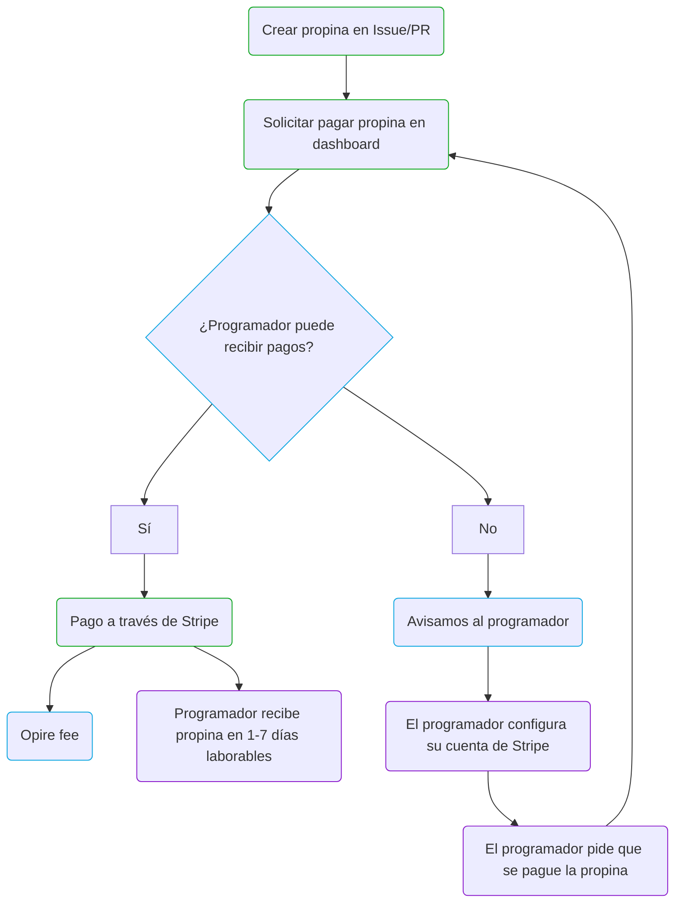

# Ciclo de vida

En Opire, el flujo de vida de una propina se inicia cuando un creador decide dar una propina a un usuario. Este proceso comienza al crear una propina asociada a un Issue o Pull Request (PR) utilizando [nuestros comandos](/es/overview/commands#dar-propina-a-un-usuario).

El creador, después de crear la propina, puede iniciar el pago de la misma a través del dashboard de Opire. En este punto, la plataforma realiza una verificación para determinar si el usuario destinatario de la propina tiene la capacidad de recibir pagos.

Si el usuario puede recibir pagos, Opire redirige al creador a una pasarela de pago de Stripe. El precio final a pagar será el de la propina más los [costes asociados](/es/tips/pricing). Tras finalizar el pago, el usuario recibe la propina aproximadamente en un plazo de 1-7 días laborables.

En cambio, si el usuario no tiene la capacidad de recibir pagos, la plataforma informa al usuario sobre esta situación para que configure su cuenta de Stripe. Una vez configurada, el usuario tendrá que avisar al creador para que intente tramitar de nuevo el pago de la propina.

---

