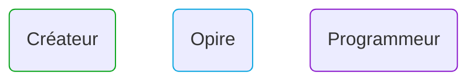
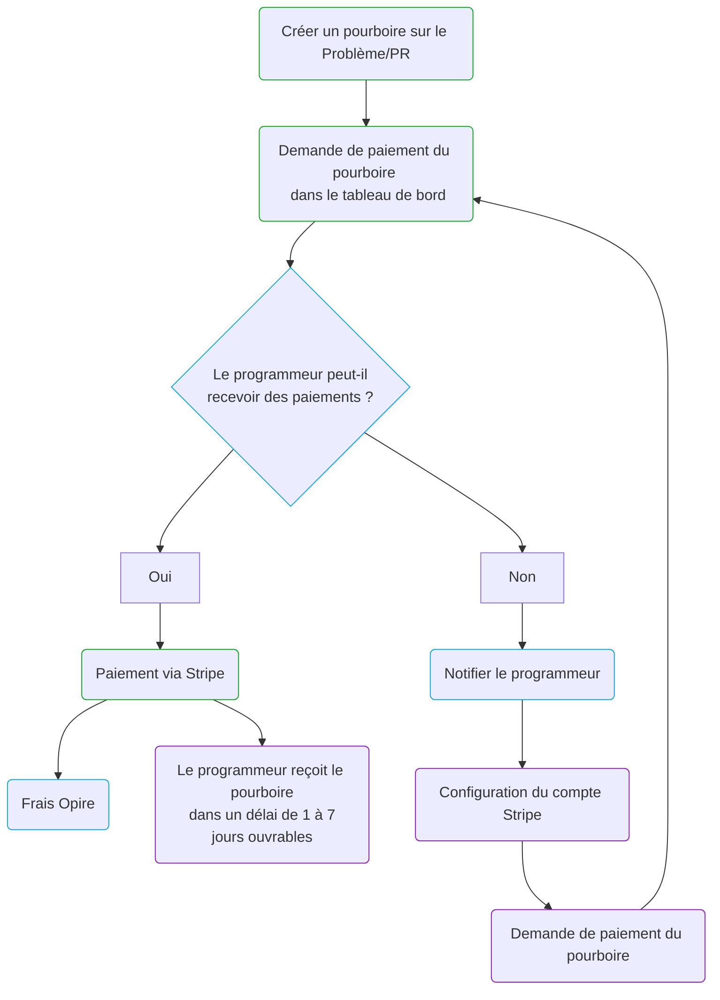

# Cycle de Vie

Chez Opire, le cycle de vie d'un pourboire commence lorsque qu'un utilisateur décide de reconnaître les efforts d'un autre utilisateur. Ce processus commence par la création d'un pourboire associé à un Problème ou une Pull Request (PR) en utilisant [nos commandes](/overview/commands#tip-a-user).

Après la création du pourboire, le créateur peut initier le paiement via le tableau de bord Opire. À ce stade, la plateforme effectue une vérification pour déterminer si l'utilisateur recevant le pourboire est capable d'accepter les paiements.

Si l'utilisateur peut recevoir les paiements, Opire redirige le créateur vers une passerelle de paiement Stripe. Le montant final à payer sera le montant du pourboire plus les [coûts associés](/tips/pricing#minimum-price-and-costs). Après avoir effectué le paiement, l'utilisateur reçoit le pourboire dans un délai approximatif de 1 à 7 jours ouvrables.

Cependant, si l'utilisateur ne peut pas recevoir les paiements, la plateforme l'informe de cette situation afin de configurer son compte Stripe. Une fois configuré, l'utilisateur doit notifier le créateur pour tenter à nouveau le paiement du pourboire.

## Diagramme de Flux

