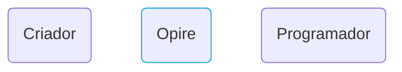
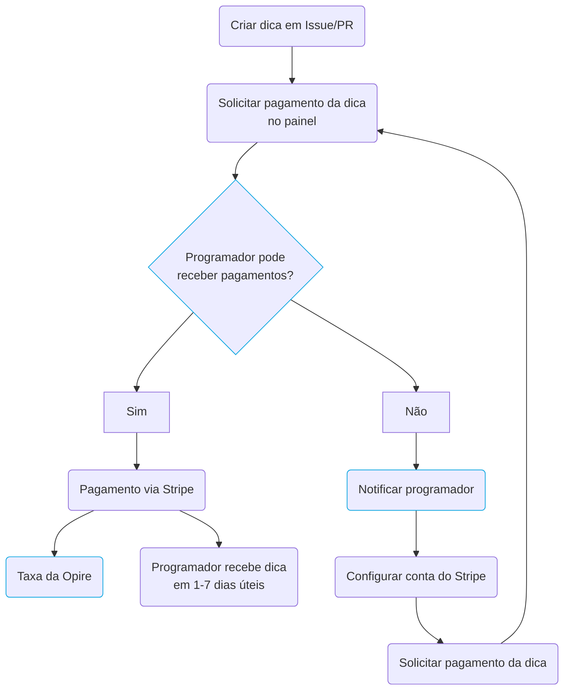

# Ciclo de Vida

Na Opire, o ciclo de vida de uma dica começa quando um usuário decide reconhecer os esforços de outro usuário. Esse processo começa criando uma dica associada a um Problema ou Pull Request (PR) usando [nossos comandos](/overview/commands#tip-a-user).

Após criar a dica, o criador pode iniciar o pagamento através do painel da Opire. Nesse ponto, a plataforma realiza uma verificação para determinar se o usuário que está recebendo a dica tem a capacidade de aceitar pagamentos.

Se o usuário puder receber pagamentos, a Opire redireciona o criador para um gateway de pagamento Stripe. O valor final a ser pago será o valor da dica mais os [custos associados](/tips/pricing#minimum-price-and-costs). Após completar o pagamento, o usuário recebe a dica em aproximadamente 1-7 dias úteis.

No entanto, se o usuário não puder receber pagamentos, a plataforma informa o usuário sobre essa situação para configurar sua conta do Stripe. Uma vez configurado, o usuário precisa notificar o criador para tentar o pagamento da dica novamente.

## Diagrama de Fluxo

