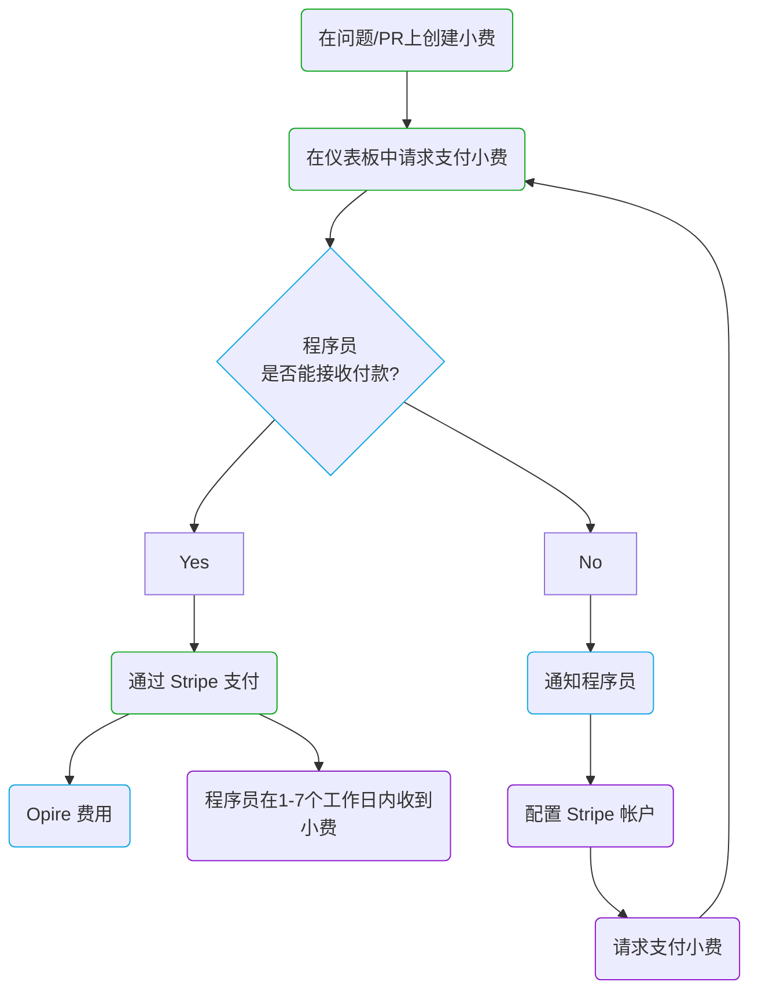

# 生命周期

在 Opire，小费的生命周期始于用户决定承认另一个用户的努力。这个过程从使用[我们的命令](/overview/commands#tip-a-user)创建与问题或拉取请求（PR）相关联的小费开始。

创建小费后，创建者可以通过 Opire 仪表板发起支付。此时，平台进行验证以确定接收小费的用户是否有能力接受付款。

如果用户可以接收付款，Opire 将重定向创建者到 Stripe 付款网关。最终要支付的金额将是小费金额加上[相关成本](/tips/pricing#minimum-price-and-costs)。完成付款后，用户将在大约 1-7 个工作日内收到小费。

然而，如果用户无法接收付款，平台将向用户通知此情况以配置他们的 Stripe 帐户。一旦配置完成，用户需要通知创建者再次尝试支付小费。

## 流程图

